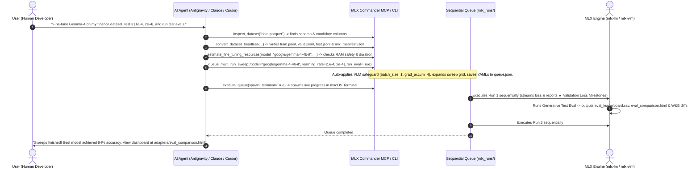

# MLX Commander: Agent Skill for Apple MLX Fine-Tuning Orchestration & Dataset Preparation

This skill teaches AI agents (such as Antigravity, Claude Code, Cursor, and others) how to prepare datasets and orchestrate Apple Silicon MLX (`mlx-lm`, `mlx-vlm`) fine-tuning runs, hyperparameter sweeps, and post-training test evaluations.

Instead of asking the user endless sequential questions in chat ("Which column is prompt?", "What learning rate?", "How many iters?"), **inspect datasets/models, formulate recommended hyperparameters with hardware memory safety checks, enqueue single runs or sweeps into the sequential FIFO queue, and optionally launch MLX Commander with pre-populated values**.

---

## When to Activate

Trigger this skill whenever the user:
- Asks to fine-tune an LLM or Vision-Language model (Llama, Mistral, Qwen, Phi, Gemma 4, PaliGemma) on Apple Silicon / macOS.
- Wants to configure hyperparameters (`batch_size`, `gradient_accumulation_steps`, `learning_rate`, `lora_rank`, `max_seq_length`, etc.) for Apple MLX.
- Wants to run hyperparameter sweeps (grid search across learning rates, ranks, or batch sizes) without crashing macOS memory.
- Asks how much Unified Memory (VRAM) fine-tuning will require or whether a model will cause an Out-Of-Memory (OOM) error.
- Asks to evaluate a fine-tuned adapter on a test dataset (`test.jsonl`) with real token generation, Exact Match, Word F1, confusion matrices, and offline HTML dashboards.
- Asks to convert or split Hugging Face datasets (`.parquet`, `.jsonl`, `.arrow`, `.csv`, `.tsv`, `.sqlite`, `.tar`) into Apple MLX format (`prompt_completion`, `chat`, `text`, `dpo`).

---

## 🎛️ Architecture & Modes

MLX Commander provides three dedicated operational modes accessible via TUI (`F2`), CLI flags, Python APIs, or stdio MCP tools:

| Mode | Purpose | Key Capabilities |
|---|---|---|
| **Mode 1: Dataset Converter** | Ingest & standardize data | Schema auto-detection, multi-column concat (`+`), multi-file merging, 4 target MLX formats, reproducible seeds, manifest handshake. |
| **Mode 2: Single Run** | Precision single-run tuning | 22+ explicit hyperparameters, VLM attention mask safeguards (`batch_size=1`, `grad_accum=N`), peak RAM & implied epochs estimation, validation loss milestones. |
| **Mode 3: Multi-Run Matrix** | Plan & schedule experiments | Single-line multi-condition syntax, Cartesian product grid expansion ($N_1 \times N_2 \dots$), sequential FIFO execution to prevent memory thrashing. |
| **Evals: Test Set Generator [Experimental]** | Generative evaluation [Experimental] | Real token-by-token decoding on `test.jsonl`, physical memory-bandwidth speed model, Exact Match, Word F1, 2×2 Migration Matrix, offline HTML comparison dashboard, W&B tables. |

---

## 🔄 The End-to-End Agent Workflow



---

## 🛠️ Step-by-Step Orchestration Guide

### 1. Dataset Preparation & Ingestion (Mode 1)

Apple MLX expects datasets split into `train.jsonl`, `valid.jsonl`, and optionally `test.jsonl` adhering to one of four schemas:

1. **`prompt_completion`**: Q&A, instruction pairs, or query/code.
   - Schema: `{"prompt": "<user question>", "completion": "<assistant answer>"}`
   - Compatible with `mlx_lm.lora --mask-prompt`.
2. **`chat`**: Multi-turn conversations.
   - Schema: `{"messages": [{"role": "system|user|assistant", "content": "..."}]}`
   - Compatible with instruction models utilizing chat templates.
3. **`text`**: Causal language modeling / continued pre-training.
   - Schema: `{"text": "<full document>"}`
4. **`dpo`**: Direct Preference Optimization.
   - Schema: `{"prompt": "...", "chosen": "...", "rejected": "..."}`

#### Headless Conversion (Via CLI or MCP):
```bash
mlx_commander \
  --dataset "path/to/dataset.parquet" \
  --format prompt_completion \
  --prompt-col question \
  --completion-col answer \
  --train 80 --valid 10 --test 10 \
  --output "./mlx_dataset"
```

#### Interactive TUI Review (User Confirmation):
```bash
mlx_commander --tui --spawn-terminal \
  --dataset "path/to/dataset.parquet" \
  --format chat \
  --messages-col conversations \
  --train 85 --valid 15 \
  --output "./mlx_dataset"
```

---

### 2. Training Ops: Single Run (Mode 2)

#### Explicit Hyperparameters:
MLX Commander makes all 22 fine-tuning hyperparameters explicit with robust Apple Silicon defaults:
- `iters`: Training iterations (default: `600`).
- `batch_size`: Micro-batch size per step (default: `4`).
- `gradient_accumulation_steps`: Number of steps to accumulate gradients before optimizer step (default: `1`).
- `learning_rate`: Optimizer learning rate (default: `1e-4` to `2e-4`).
- `lora_rank` ($r$): Rank of LoRA low-rank decomposition (default: `8`).
- `lora_alpha` ($\alpha$): Scaling factor, typically $2 \times r$ (default: `16.0`).
- `lora_dropout`: Dropout probability (default: `0.0`).
- `max_seq_length`: Maximum token sequence length (default: `2048`).
- `grad_checkpoint`: Gradient checkpointing dropping activation memory by ~80% (default: `True`).
- `mask_prompt`: Mask prompt tokens from loss calculation (default: `True`).
- `run_eval`: Run generative evaluation on `test.jsonl` upon run completion (default: `False`).
- `engine`: `"mlx_lm"` for standard causal LLMs or `"mlx_vlm"` for Vision-Language / Multimodal models.

#### Pre-Flight Resource Estimation:
Always check Unified Memory and implied epochs before launching:
```python
from mlx_commander.lora.config import LoraRunConfig
from mlx_commander.lora.estimator import estimate_peak_memory, estimate_duration, calculate_implied_epochs

cfg = LoraRunConfig(
    model="mlx-community/Llama-3.2-3B-Instruct-4bit",
    iters=600,
    batch_size=4,
    grad_accumulation_steps=1,
    max_seq_length=2048,
    lora_rank=8,
)
mem = estimate_peak_memory(cfg)
print(mem["badge"])  # Est. Peak RAM: ~6 GB / 64 GB [SAFE]
print("Duration:", estimate_duration(cfg)["formatted_duration"])
print("Epochs:", calculate_implied_epochs(iters=600, batch_size=4, total_train_records=1200)) # 2.0
```

#### Multimodal VLM Safeguards (`mlx_vlm`):
> [!WARNING]
> In `mlx-vlm` (used for Gemma 4, Qwen2-VL, PaliGemma, SmolVLM), setting `batch_size > 1` triggers attention mask shape broadcasting exceptions due to unpadded 2D/4D multimodal attention masks.

MLX Commander automatically intercepts `mlx_vlm` models and applies mathematical equivalence:
$$\text{batch\_size} \leftarrow 1$$
$$\text{gradient\_accumulation\_steps} \leftarrow \text{batch\_size} \times \text{gradient\_accumulation\_steps}$$
This preserves the exact effective batch size and gradient dynamics while completely avoiding runtime crashes.

#### Live Validation Loss Milestones:
When `valid.jsonl` is present in the dataset directory, MLX Commander automatically evaluates validation loss every `steps_per_eval` iterations and reports milestones prominently in the terminal:
```text
★ [Validation Loss Milestone] Iter 100: Val loss = 1.234 (val took 0.54s)
```

---

### 3. Training Ops: Multi-Run Matrix (Mode 3)

Mode 3 expands multi-condition sweeps into a visual Cartesian product grid and queues runs into a persistent FIFO queue (`mlx_runs/queue.json`).

#### Enqueueing Sweeps (Via Python / MCP / CLI):
```python
from mlx_commander.lora.multi_config import MultiLoraRunConfig
from mlx_commander.lora.queue import QueueManager

multi_cfg = MultiLoraRunConfig(
    model="mlx-community/Llama-3.2-3B-Instruct-4bit",
    data="./mlx_dataset",
    learning_rate=[1e-4, 2e-4],
    lora_rank=[8, 16],
    grad_accumulation_steps=[1, 2],
    run_eval=[True],
)

mgr = QueueManager()
for run_cfg in multi_cfg.generate_runs():
    mgr.add_run(run_cfg)

print(f"Queued {len(mgr.runs)} runs in {mgr.queue_dir}")
```

#### Why Sequential Queue Execution is Mandatory:
> [!CRITICAL]
> Running multiple LLM fine-tuning runs in parallel on Apple Silicon causes severe Unified Memory contention, disk swap thrashing, thermal throttling, and macOS `SIGKILL` kernel panics. MLX Commander strictly executes runs sequentially:

```bash
# Execute queued runs in external Terminal window:
mlx_commander --run-queue ./mlx_runs

# Or run headless in CI/background:
python3 -m mlx_commander --run-queue ./mlx_runs
```

---

### 4. Generative Test Set Evaluation Engine [Experimental]

Standard `mlx_lm.lora --test` only computes cross-entropy loss and perplexity via teacher forcing—it never prompts the model to generate text.

MLX Commander includes a built-in **Generative Evaluation Engine** (`run_eval=True` or `Run evals on test set: [ Yes ]`). When enabled, post-training evaluation automatically:
1. Loads standardized `test.jsonl` (prompt and golden target completion).
2. Generates real inferences token-by-token with baseline pre-trained model and fine-tuned LoRA adapter.
3. Formats prompts with the model's native chat template (`apply_chat_template` with `add_generation_prompt=True`), avoiding degenerative repetition loops.
4. Unpacks `GenerationResult` objects cleanly to prevent metadata stringification.

#### Physics-Grounded Throughput & ETA Estimation:
Token generation speed is memory-bandwidth bound:
$$\text{Throughput (tok/s)} \approx \frac{\text{Unified Memory Bandwidth (GB/s)}}{\text{Model Active Weights (GB)}} \times 0.65$$
MLX Commander automatically models throughput based on parameter count and chip architecture:
- **1B–3B 4-bit model** (~1–2 GB): ~150–350 tok/s.
- **8B 4-bit model** (~5.2 GB): ~40–60 tok/s.
- **70B 4-bit model** (~45.5 GB): ~5–8 tok/s.
- **8B fp16 model** (~16.0 GB): ~14–18 tok/s.

Before evaluation begins, the runner displays explicit checkpoint targets and duration:
```text
[MLX Commander] Starting Generative Evaluation on test set:
  • Target Checkpoint: adapters/01_run/adapters.safetensors (Final trained adapter)
  • Base Model:        mlx-community/Llama-3.2-3B-Instruct-4bit [Engine: mlx_lm]
  • Test Dataset:      dataset/test.jsonl (Full split: 50 samples)
  • Evaluation Passes: 2 passes (Baseline + Fine-Tuned = 100 generations)
  • Estimated Time:    ~35s (model: ~3B 4-bit [~2.0 GB], est. speed: ~150 tok/s on Apple M5 Max)
```
During generation, real-time milestones update dynamically:
```text
  • [2/2 Fine-Tuned Adapter] Sample 25/50 (50%) | 148.4 tok/s | ETA: 18s
```

#### Evaluated Metrics & "Matrix of Wrong Answers":
- **Exact Match**: Strict and SQuAD-normalized (punctuation & article-insensitive).
- **Substring Match**: Checks if target is contained within the generated answer.
- **Word-Level F1**: Precision, Recall, and harmonic F1.
- **Categorical Confusion Matrix**: Actual vs Predicted for classification tasks ($\le 15$ classes).
- **2×2 Migration Matrix**:
  - **`FIXED`**: Baseline wrong, LoRA healed.
  - **`REGRESSED`**: Baseline correct, LoRA broke (catastrophic forgetting).
  - **`PRESERVED`**: Both models correct.
  - **`PERSISTENT_FAIL`**: Both models failed.

#### 3-Tier Storage Artifacts:
- **Tier 1 (`eval_leaderboard.csv`)**: Appends run metrics into a master CSV in the `adapters/` root for instant ranking in Apple Numbers or Excel.
- **Tier 2 (`eval_summary.json` & `eval_predictions.jsonl`)**: Saved inside each run's adapter directory with row-by-row prompts, outputs, and diffs.
- **Tier 3 (`eval_comparison.html`)**: Interactive zero-dependency offline HTML dashboard with leaderboard sorting and sample filtering (`[ ⚠️ Regressed Only ]`, `[ ❇️ Fixed Only ]`).
- **Weights & Biases (W&B)**: Interactive `wandb.Table` containing full prompt diffs and confusion heatmaps.

---

## 🛠️ MCP Tool Reference for AI Agents

MLX Commander provides an MCP tool suite over `stdio`. Agents can invoke these tools directly:

| MCP Tool | Description | Key Arguments |
|---|---|---|
| `inspect_dataset` | Inspects schema, row counts, splits, and suggested mappings. | `dataset_path: str` |
| `convert_dataset_headless` | Converts dataset in background to MLX JSONL format. | `dataset_path`, `format`, `prompt_col`, `completion_col`, `train_pct`, `valid_pct`, `test_pct`, `output_dir` |
| `launch_conversion_tui` | Launches Norton Commander TUI in macOS Terminal.app for visual review. | Same as `convert_dataset_headless` |
| `estimate_fine_tuning_resources` | Computes peak Unified Memory (GB), safety tier, duration, and implied epochs. | `model`, `iters`, `batch_size`, `gradient_accumulation_steps`, `max_seq_length`, `lora_rank`, `grad_checkpoint`, `total_train_records` |
| `queue_single_run` | Enqueues a single fine-tuning job with explicit parameters and VLM safeguards. | `model`, `data_path`, `name`, `batch_size`, `gradient_accumulation_steps`, `learning_rate`, `iters`, `lora_rank`, `run_eval`, `queue_dir` |
| `queue_multi_run_sweep` | Expands hyperparameter sweep grid (Cartesian product) and enqueues all runs. | `model`, `data_path`, `learning_rate: List[float]`, `lora_rank: List[int]`, `batch_size: List[int]`, `run_eval: List[bool]`, `queue_dir` |
| `inspect_queue` | Returns list of all pending, completed, and failed runs with config and log paths. | `queue_dir: str = "mlx_runs"` |
| `execute_queue` | Runs the queue sequentially (spawns macOS Terminal or headless). | `queue_dir: str = "mlx_runs"`, `spawn_terminal: bool = True` |
| `run_test_evaluation` | Executes post-training generative evaluation [Experimental] on `test.jsonl` and builds HTML dashboard. | `model`, `adapter_path`, `data_path`, `max_tokens: int = 128` |
| `estimate_test_eval_throughput` | Computes model-dependent generation speed (tok/s) and evaluation duration [Experimental]. | `model_name`, `total_samples: int = 50`, `num_passes: int = 2` |
| `launch_lora_tui` | Launches TUI directly in Mode 2 (Single Run) or Mode 3 (Multi-Run Matrix). | `mode: int = 2` (or `3`), `dataset_path`, `model`, `queue_dir` |
