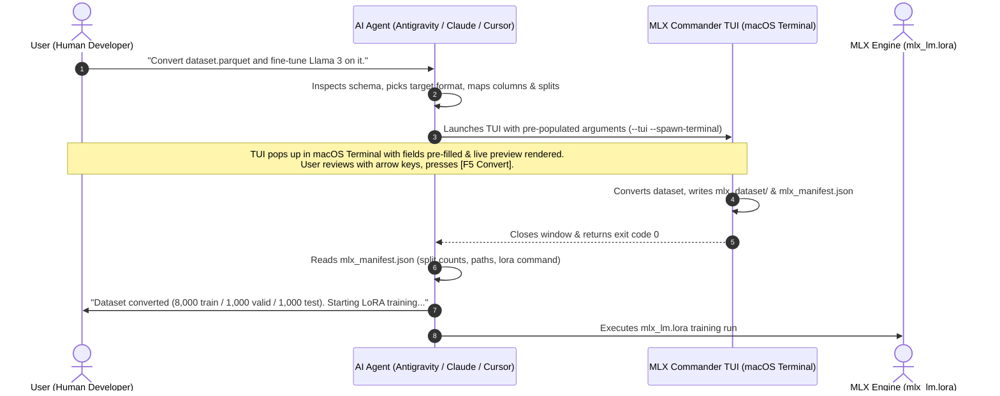

# MLX_Commander 🚀

A fast, persistent dual-panel TUI (Norton Commander style) & CLI converter for preparing Hugging Face datasets into Apple Silicon MLX fine-tuning formats (`mlx-lm`).

Built entirely with Python's standard library `curses` with zero mandatory dependencies and zero pre-compiled binaries.


*Orthodox TUI which makes MLX defaults explicit*

---

## 🌟 Key Features

- **Persistent Multi-Panel TUI (Norton Commander style)**: Full keyboard navigation (`Tab` to switch panels, `↑`/`↓` to navigate, `Enter` to edit/open dropdowns, `F5` to convert).
- **AI Agent Skill & TUI Pre-Population**: Coding agents (Antigravity, Claude, Cursor) can inspect dataset schemas, pre-populate format, column mappings, and splits, and launch the TUI for split-second visual confirmation.
- **macOS Terminal.app Spawner**: Seamless handoff from non-interactive agent environments to an interactive TUI window via AppleScript.
- **Model Context Protocol (MCP) Server**: Native stdio MCP server exposing dataset inspection, TUI launching, and headless conversions to Claude Desktop and Cursor.
- **Machine-Readable Manifest (`mlx_manifest.json`)**: Emits structured output with file paths, row counts, and copy-paste `mlx_lm.lora` commands for automated downstream pipelines.
- **Multi-File Selection & Dataset Merging**: Select multiple dataset files at once (e.g. combining pre-split `train.jsonl` and `test.jsonl`). Verifies that all files have identical column schemas and merges them so you can randomize fresh Train / Validation / Test sets from scratch with a custom seed.
- **Multi-Column Concatenation**: Tap `Space` to multi-select and order columns from the original dataset (e.g. `instruction + input`) to concatenate them seamlessly with `\n\n`.
- **Live Reactive Preview**: Sample records format in real time as you change target formats or adjust column mappings.
- **Instantaneous ESC Response**: Curses escape delay configured to 25ms (< 1 frame), making modal dismissal instantaneous while preserving arrow and function keys.
- **Native macOS Cocoa Finder Picker**: Seamlessly select dataset folders or files via native macOS dialogs (compiled on the fly in `/tmp` with zero checked-in binaries).
- **Supported MLX Formats**:
  1. **Text Format**: `{"text": "..."}` — Causal LM / pre-training (single column, concatenated columns, or custom template).
  2. **Chat / Messages Format**: `{"messages": [{"role": "system|user|assistant", "content": "..."}]}` — Supports message lists (standard role/content or ShareGPT `from`/`value`), or separate role columns.
  3. **Prompt & Completion Format**: `{"prompt": "...", "completion": "..."}` — Q&A / instruction fine-tuning (`mlx_lm.lora --mask-prompt` compatible).
  4. **DPO / Preference Format**: `{"prompt": "...", "chosen": "...", "rejected": "..."}` — Direct Preference Optimization.
- **3-Mode Switcher Navigation (`F2`)**: Instant cycling between `[ 1: Dataset Converter ]`, `[ 2: Fine-Tuning Single Run ]`, and `[ 3: Fine-Tuning Multi-Run ]`.
- **Mode 3: Fine-Tuning Multi-Run (Hyperparameter Sweeps)**: Configure multiple conditions per hyperparameter on a single line with clickable rightmost targets, review a visual Cartesian product grid (`✖` layout), and schedule batch queues.
- **Unified RAM Safety & Implied Epochs Estimator**: Real-time calculation of peak unified RAM (with `[SAFE]`, `[TIGHT]`, `[OOM RISK]` ratings) and implied epochs (with warning alerts when $< 1.0$).
- **Generative Test Set Evaluation Engine (experimental)**: Evaluates real model inferences on `test.jsonl` deterministically—measuring Exact Match, Substring Match, Word-Level F1 (Precision & Recall), Categorical Confusion Matrices, and 2×2 Model Migration & Regression Matrices.
- **3-Tier Storage & Offline Dashboard**: Appends to `eval_leaderboard.csv` (opens in Numbers/Excel), outputs per-run JSON/JSONL artifacts, and renders an interactive offline `eval_comparison.html` dashboard with regression filters and text diffs.
- **Weights & Biases (W&B) Logging**: Streams training loss and logs interactive evaluation prediction tables (`wandb.Table`) and confusion heatmaps (`wandb.plot.confusion_matrix`).
- **Flexible Data Loader**: Parquet (`.parquet`), Arrow (`.arrow`), Hugging Face `save_to_disk` directories, JSONL (`.jsonl`), JSON arrays (`.json`), CSV (`.csv`), TSV (`.tsv`), SQLite (`.sqlite`, `.db`), and WebDataset (`.tar`).
- **Deterministic Splits & Random Seed**: Customizable Train / Validation / Test percentages with 100% reproducible shuffling via random seed.
- **Ready-to-Use `mlx_lm.lora` Command**: Generates the exact training command ready to copy-paste.
- **CLI Wizard & Headless Modes**: Run line-by-line via `--wizard` or fully automated via headless CLI flags.


*Inspired by Norton Commander, with a classic color scheme available in TUI*

---

## 📦 Quick Start

### 1. Launch MLX Commander (Default)

Launch the interactive dashboard using any of these equivalent commands:

```bash
# Install via pip from PyPI and run anywhere:
pip install mlx_commander
mlx_commander

# Or install with all format extras (Parquet, Arrow, DuckDB, Lance, MCP):
pip install "mlx_commander[all]"
mlx_commander

# Or run instantly without installation via uvx:
uvx mlx_commander

# Or install globally as a tool via uv:
uv tool install mlx_commander
mlx_commander

# Recommended for local repository execution (Primary):
python3 mlx_commander.py

# Or via secondary compatibility alias:
python3 run.py

# Or as a Python package module:
python3 -m mlx_commander
```

You can also pass arguments directly (e.g. pre-loading a dataset or multiple files):
```bash
python3 mlx_commander.py -d /path/to/my_hf_dataset
# Or combine multiple files:
python3 mlx_commander.py -d train.jsonl test.jsonl
# (python3 run.py accepts all the same arguments)
```

### 2. Line-by-Line Wizard Mode

For SSH sessions or non-curses environments:

```bash
python3 mlx_commander.py --wizard
```

### 3. Direct Command-Line Conversion (Automated / Headless)

You can pass all options via flags for direct scripted conversions:

```bash
python3 mlx_commander.py \
  --dataset /path/to/my_hf_dataset \
  --format prompt_completion \
  --prompt-col instruction \
  --completion-col output \
  --output ./mlx_data \
  --train 80 \
  --valid 10 \
  --test 10 \
  --seed 42
```

---

## 🖥️ Command Line Reference

```
usage: mlx_commander [-h] [-v] [-d DATASET [DATASET ...]]
                     [-f {text,chat,prompt_completion,dpo}]
                     [-o OUTPUT] [--train TRAIN] [--valid VALID] [--test TEST]
                     [--seed SEED] [--keep-splits] [--mapping MAPPING]
                     [--text-col TEXT_COL] [--text-template TEXT_TEMPLATE]
                     [--prompt-col PROMPT_COL] [--completion-col COMPLETION_COL]
                     [--messages-col MESSAGES_COL] [--user-col USER_COL]
                     [--assistant-col ASSISTANT_COL] [--system-col SYSTEM_COL]
                     [--chosen-col CHOSEN_COL] [--rejected-col REJECTED_COL]
                     [--commander] [--wizard]
```

### Key Flags:

| Flag | Description |
|---|---|
| `-d`, `--dataset` | Path to HF dataset directory or file on disk (`.arrow`, `.parquet`, `.jsonl`, `.json`, `.csv`). |
| `-f`, `--format` | Target MLX format (`text`, `chat`, `prompt_completion`, `dpo`). |
| `-o`, `--output` | Destination directory where `train.jsonl`, `valid.jsonl`, and `test.jsonl` are saved. |
| `--train` | Percentage of data for training (e.g. `80.0`). |
| `--valid` | Percentage of data for validation (e.g. `10.0`). |
| `--test` | Percentage of data for test (e.g. `10.0`, or `0` to omit). |
| `--seed` | Integer random seed for reproducible random shuffling. |
| `--keep-splits` | Preserve existing dataset splits without re-splitting. |
| `--text-col` | Column to use as `text` for `text` format. |
| `--text-template`| Template string with `{column_name}` variables for `text` format. |
| `--prompt-col` | Column to map to `prompt`. |
| `--completion-col` | Column to map to `completion`. |
| `--messages-col` | Column containing conversation turns list for `chat` format. |
| `--user-col` | Column for user turn in multi-column `chat` format. |
| `--assistant-col`| Column for assistant turn in multi-column `chat` format. |
| `--system-col` | Column for system prompt in multi-column `chat` format. |
| `--chosen-col` | Column for preferred response in `dpo` format. |
| `--rejected-col`| Column for dispreferred response in `dpo` format. |
| `--manifest-file`| Custom file path where machine-readable `mlx_manifest.json` will be saved. |
| `--prefill-state`| Pre-populate TUI state from a JSON string or path to JSON file. |
| `--spawn-terminal`| Launch interactive TUI in an external macOS Terminal window. |
| `--lora` | Launch TUI directly into LoRA Fine-Tuning mode (Mode 2). |
| `--run-queue [DIR]`| Execute queued LoRA fine-tuning runs sequentially (default: `mlx_runs`). |
| `--mcp` | Start Model Context Protocol (MCP) server over stdio. |
| `--tui` | Force launch full-screen curses TUI. |
| `--no-tui`, `--cli` | Run line-by-line CLI wizard instead of curses TUI. |

---

## 🦙 Apple MLX LoRA Fine-Tuning & Queue Orchestration (Mode 2)

MLX Commander features a dedicated **LoRA Fine-Tuning Dashboard** alongside Dataset Conversion. Press **`[F2]`** inside the TUI or pass `--lora` from the command line to switch modes.

```bash
# Launch directly into Mode 2 (LoRA Fine-Tuning):
mlx_commander --lora
```

### 1. Dual-Panel Fine-Tuning Setup
- **Top Left Panel (Model & Dataset Setup)**:
  - **Base Model Picker**: Instant select from curated 4-bit Apple MLX models (`Llama-3.2-3B`, `Llama-3.1-8B`, `Qwen2.5-7B`, `Mistral-7B`, `Phi-3.5-mini`, etc.) or input custom Hugging Face model IDs and local weights.
  - **Dataset Directory**: Auto-synced from Mode 1 conversion output, or selected via macOS Finder / local path entry.
  - **Method**: Select `lora`, `dora` (Weight-Decomposed Low-Rank Adaptation), or `full`.
  - **Optimizer**: Pick `adamw` or `adam`.
  - **Run Name**: Custom label or auto-generated descriptive run title.

- **Top Right Panel (Explicit Hyperparameters & Hardware Estimators)**:
  - **Explicit Hyperparameters**: All 22 MLX fine-tuning parameters made explicit with production defaults: `iters`, `batch_size`, `learning_rate`, `lora_rank`, `lora_alpha`, `lora_dropout`, `max_seq_length`, `num_layers`, `grad_checkpoint`, `mask_prompt`, `save_every`, `steps_per_eval`, and `adapter_path`.
  - **Reactive Implied Number of Epochs**: Automatically calculated via `(iters * batch_size) / total_train_records`.
  - **Unified Memory Estimator**: Detects your exact Apple Silicon chip and physical RAM via `sysctl hw.memsize` and computes peak memory consumption:
    - **`[SAFE]`** (<70% RAM): Ideal headroom for macOS window server and applications.
    - **`[TIGHT]`** (70–85% RAM): Viable, but close to memory pressure thresholds.
    - **`[OOM RISK]`** (>85% RAM): Flags configuration risk and recommends enabling gradient checkpointing or reducing batch size/sequence length before you start training.
  - **Duration & Clock ETA**: Estimates wall-clock training time based on hardware throughput and step count.

### 2. Central Queue & Config Browser
Queue up multiple experiments (e.g. testing 3 learning rates across 2 models) in a persistent FIFO queue:
- **`[F6]` Add Run**: Saves current configuration to the queue (`mlx_runs/configs/<run_id>.yaml` and `mlx_runs/queue.json`).
- **`[c]` Clone**: Duplicate the highlighted run to quickly tweak a single parameter like learning rate or rank.
- **`[d]` Delete**: Remove a run from the queue.
- **`[x]` Clear**: Empty the queue.
- **`[Enter]` Load**: Load any queued run back into the editor form to inspect or modify it.

### 3. Sequential Queue Execution
> [!IMPORTANT]
> **Sequential Execution Only**: Running multiple LLM fine-tuning runs simultaneously causes severe unified memory thrashing, swap exhaustion, and macOS `SIGKILL` kernel panics. MLX Commander strictly enforces sequential execution (FIFO).

Press **`[F5 Run Queue]`**:
- MLX Commander automatically spawns an independent macOS Terminal.app window running `mlx_commander --run-queue mlx_runs`.
- Training stdout, iteration loss, and throughput stream live in the external window.
- **You may safely close MLX Commander at any time** without interrupting background training.
- You can also run the queue headless on headless servers or subshells:
  ```bash
  python3 -m mlx_commander --run-queue ./mlx_runs
  ```

---

## 🤖 AI Agent Integration & MCP Support

MLX Commander is designed for the modern AI agent era (**Antigravity**, **Claude Desktop**, **Cursor**, **Zed**, **Cline**). 

Instead of an agent interrogating users with 10 sequential chat prompts or guessing schemas blindly, agents can **inspect schemas, formulate recommended settings, and launch MLX Commander with pre-populated values**. 

The user gets a 3-second tactile review with live JSONL preview in the Norton Commander TUI, presses **[F5 Convert]**, and hands control back to the agent with a machine-readable manifest.

### 🔄 The End-to-End Workflow



---

### The Three Architectural Hand-offs

#### 1. Hand-off 1: TUI State Pre-Population
Agents can pre-populate every field of `CommanderState` via CLI flags or a JSON payload:
- **Via CLI Flags**:
  ```bash
  mlx_commander --tui --spawn-terminal \
    --dataset "./data.parquet" \
    --format chat \
    --messages-col conversations \
    --train 85 --valid 15 \
    --output "./mlx_dataset"
  ```
- **Via JSON (`--prefill-state`)**:
  ```bash
  mlx_commander --tui --spawn-terminal \
    --prefill-state '{"dataset": "./data.parquet", "format": "prompt_completion", "prompt_col": "question", "completion_col": "answer", "train": 80, "valid": 20}'
  ```
When launched with pre-fill data, the TUI opens directly with focus on the mappings panel and renders the reactive JSONL preview immediately.

#### 2. Hand-off 2: Machine-Readable Manifest Handshake (`mlx_manifest.json`)
Every conversion automatically outputs `output_dir/mlx_manifest.json` (or to a custom path specified with `--manifest-file <path>`):

```json
{
  "status": "success",
  "format": "prompt_completion",
  "source_path": "/path/to/source.parquet",
  "output_dir": "/path/to/mlx_dataset",
  "files": {
    "train": {
      "path": "/path/to/mlx_dataset/train.jsonl",
      "filename": "train.jsonl",
      "records": 8000,
      "size_bytes": 1048576
    },
    "valid": {
      "path": "/path/to/mlx_dataset/valid.jsonl",
      "filename": "valid.jsonl",
      "records": 1000,
      "size_bytes": 131072
    },
    "test": {
      "path": "/path/to/mlx_dataset/test.jsonl",
      "filename": "test.jsonl",
      "records": 1000,
      "size_bytes": 131072
    }
  },
  "splits": { "train": 8000, "valid": 1000, "test": 1000 },
  "total_records": 10000,
  "seed_used": 42,
  "mlx_lora_command": "mlx_lm.lora --model mlx-community/Llama-3.2-3B-Instruct-4bit --train --data /path/to/mlx_dataset --mask-prompt --iters 600 --batch-size 4",
  "manifest_path": "/path/to/mlx_dataset/mlx_manifest.json"
}
```

- **Exit Code 0**: Conversion succeeded; manifest written.
- **Exit Code 130**: User cancelled/closed the TUI without converting. If `--manifest-file` was set, writes `{"status": "cancelled"}`.

#### 3. Hand-off 3: macOS Terminal.app Spawner
When invoked by background agent runners (such as IDE extensions, subshells, or MCP daemons) without an active TTY:
- Passing `--spawn-terminal` (or auto-detected on macOS in non-interactive sessions) executes the TUI in a dedicated macOS `Terminal.app` window via AppleScript.
- The calling process blocks synchronously until the user converts or exits, then unblocks and returns the exit code and manifest.

---

### Model Context Protocol (MCP) Server

MLX Commander includes a built-in MCP server that works over `stdio`.

#### 1. Claude Desktop Setup (`claude_desktop_config.json`):
```json
{
  "mcpServers": {
    "mlx_commander": {
      "command": "python3",
      "args": ["-m", "mlx_commander", "--mcp"]
    }
  }
}
```
*Or via zero-install `uvx`:*
```json
{
  "mcpServers": {
    "mlx_commander": {
      "command": "uvx",
      "args": ["--from", "git+https://github.com/tomkubik/mlx_commander.git", "--with", "mcp", "mlx_commander", "--mcp"]
    }
  }
}
```

#### 2. Cursor Setup (`.cursor/mcp.json`):
```json
{
  "mcpServers": {
    "mlx_commander": {
      "command": "python3",
      "args": ["-m", "mlx_commander", "--mcp"]
    }
  }
}
```

#### 3. Exposed MCP Tools:

| MCP Tool | Description | Arguments |
|---|---|---|
| `inspect_dataset` | Inspects columns, total rows, split names, sample records, and auto-detects candidate mappings. | `dataset_path: str` |
| `launch_conversion_tui` | Pre-populates and opens the TUI in macOS Terminal.app for user review. Returns conversion manifest. | `dataset_path`, `format`, `prompt_col`, `completion_col`, `messages_col`, `train_pct`, `valid_pct`, `test_pct`, `output_dir` |
| `convert_dataset_headless` | Runs direct headless conversion in background without opening TUI. Returns conversion manifest. | Same arguments as `launch_conversion_tui` |

#### 4. Exposed MCP Prompt:
- **`prepare_dataset_for_mlx`**: Instructs the model on the optimal workflow to inspect the schema, formulate column mappings, and launch the conversion TUI.

---

### Agent Skill (`SKILL.md`)

A standardized skill specification is included in the repository:
- Skill path: [`.agents/skills/mlx-dataset-prep/SKILL.md`](.agents/skills/mlx-dataset-prep/SKILL.md)

AI agents that support skill discovery (like **Antigravity**) automatically read this file when users ask to convert datasets or fine-tune models with Apple MLX.

---

## 🛠️ Step-by-Step Wizard Walkthrough

1. **Step 1: Dataset Source**: Select your dataset folder or file on your drive. The tool validates the file, inspects column names, row counts, and existing splits.
2. **Step 2: MLX Format**: Choose your target format (`Text`, `Chat / Messages`, `Prompt & Completion`, `DPO / Preference`).
3. **Step 3: Column Mapping**: Match dataset columns to MLX fields or enter a formatting template. The tool automatically detects candidate columns.
4. **Step 4: Splitting & Seed**: Configure Train / Valid / Test percentages. A random seed is automatically generated, and you can accept it or provide your own.
5. **Step 5: Output & Preview**: Specify the destination folder, review a live preview of the formatted JSONL lines, and confirm to write the files.
6. **Step 6: Ready to Fine-Tune**: Review written file sizes, row counts, and copy the generated `mlx_lm.lora` fine-tuning command.

---

## 🚀 Running Fine-Tuning with Apple MLX

MLX Commander provides two interactive fine-tuning dashboards directly integrated with Apple MLX (`mlx-lm`):

---

### 🎛️ Mode 2: Fine-Tuning Single Run

Press `F2` to switch to `[ 2: Fine-Tuning Single Run ]`:
- **Model & Dataset Configuration**: Select any MLX community model (e.g. `Llama-3.2-3B-Instruct-4bit`, `Qwen2.5-7B-Instruct-4bit`) or local weights.
- **Unified RAM Safety Estimator**: Computes predicted peak unified memory footprint before starting training, rating safety as `[SAFE]`, `[TIGHT]`, or `[OOM RISK]`.
- **Implied Epochs Calculation**:
  $$\text{Epochs} = \frac{\text{iters} \times \text{batch\_size}}{\text{train\_records}}$$
  If epochs $< 1.0$, the estimate is highlighted in **dark red** to warn that the model will not see the full training set.
- **Sequential Queue Management**: Add runs to queue with `F6`, inspect queued jobs, and execute sequentially without memory thrashing.
- **Deterministic Checkpoint Naming**: Adapters are saved with full hyperparameter signatures:
  `0000400_adapters_lora_r16_a32_lr1e-5_b4_i1000_Llama-3.2-3B-Instruct-4bit.safetensors`

---

### 🎛️ Mode 3: Fine-Tuning Multi-Run (Hyperparameter Sweeps)

Press `F2` to switch to `[ 3: Fine-Tuning Multi-Run ]`:
- **Single-Line Multi-Value Fields**: Specify multiple condition values per hyperparameter on a single line:
  ```text
  Learning Rate:    [ 1e-4 ]  [ 2e-4 ]  [ 5e-4 ]
  LoRA Rank (r):    [ 2 ]  [ 4 ]  [ 6 ]  [ 8 ]
  Mask Prompt:      [ True ]  [ False ]
  ```
- **Clickable Rightmost Target**: The rightmost box represents the active clickable target. Press `Enter` to open a modal dialog to amend or enter conditions as a comma-separated list (e.g., `2, 4, 8`).
- **Visual Cartesian Sweep Grid**: Renders a dedicated bottom panel displaying parameter columns, vertically stacked cells with internal dividers, centered `✖` multiplication symbols, and total scheduled run count (e.g. $3 \times 4 \times 2 = 24 \text{ training runs}$).
- **Aggregated Runtime Estimates**:
  - **Peak Unified RAM**: Maximum peak RAM across all sweep conditions.
  - **Total Duration**: Sum of estimated durations for all scheduled runs.
  - **Min Implied Epochs**: Minimum implied epochs across all conditions.

---

## 📊 Generative Test Set Evaluation Engine (experimental)

Standard `mlx_lm.lora --test` only computes cross-entropy loss and perplexity via teacher forcing—it never actually prompts the model to generate text.

MLX Commander includes a built-in **Generative Evaluation Engine** tagged as `(experimental)`. When enabled, the fine-tuned model loads after training, generates answers token-by-token on `test.jsonl`, and scores them deterministically against golden reference completions without requiring external scripts.

### ⚙️ Enabling the Feature
In the right-hand hyperparameter pane (available in both Mode 2 and Mode 3):
- **Field**: `Run evals on test set (experimental): [ No ]`
- **Default**: `No` (disabled by default so training runs quickly unless explicitly enabled)
- **Toggling**: Press `Enter` on the field row to flip it to `[ Yes ]` (or enter `Yes, No` conditions in Mode 3).

---

### 📈 Evaluated Metrics

1. **Exact Match (Strict & Normalized)**:
   - *Strict*: Character-for-character equality (`gen == golden`).
   - *Normalized*: SQuAD-standard matching stripping whitespace, punctuation, and English articles (`a`, `an`, `the`).
2. **Substring Contains Match**:
   - Checks if the golden completion appears anywhere inside the model's generated text (e.g., Golden: `42`, Output: `The answer is 42.`).
3. **Word-Level Precision, Recall, and F1 Score**:
   - Evaluates the actual textual words of the output against the target:
     - **Word Recall**: Did the model capture all key facts?
     - **Word Precision**: Did the model avoid hallucinations and unnecessary fluff?
     - **Word F1**: The harmonic mean giving fair partial credit when the model answers correctly in full sentences.
4. **Generation Speed & Efficiency**:
   - Measures inference throughput in **Tokens per Second (TPS)** and average latency per sample.

---

### 🧩 The "Matrix of Wrong Answers"

1. **Categorical Confusion Matrix** (for classification tasks):
   - Automatically computed if the test set has $\le 15$ unique target classes.
   - Generates a full `[Actual] × [Predicted]` confusion matrix with per-class recall and overall accuracy.
2. **2×2 Model Migration & Regression Matrix** (for all open-ended text tasks):
   - Automatically compares the **Baseline Pre-Trained Model** vs the **Post-Tuning LoRA Model**:

```text
                        POST-TUNING (LoRA)
                     CORRECT           WRONG
                ┌────────────────┬────────────────┐
      CORRECT   │   PRESERVED    │   REGRESSED    │  ◄ Catastrophic forgetting!
BASELINE        ├────────────────┼────────────────┤
      WRONG     │     FIXED      │   PERSISTENT   │  ◄ Where LoRA healed the model!
                └────────────────┴────────────────┘
```
- **`FIXED`**: Prompts the base model failed, but LoRA answered correctly (healed!).
- **`REGRESSED`**: Prompts the base model got right, but LoRA broke (catastrophic forgetting).
- **`PRESERVED`**: Prompts both models answered correctly.
- **`PERSISTENT_FAIL`**: Hard samples failed by both models.

---

### 💾 3-Tier Storage & Offline Dashboard

Evaluation results are organized hierarchically across 3 tiers:

```text
models/Llama-3.2-3B/adapters/
├── eval_leaderboard.csv                    <-- TIER 1: Master CSV (open in Numbers/Excel)
├── eval_comparison.html                   <-- TIER 3: Standalone interactive dashboard
│
└── 01_lora_r16_a32_lr1e-4_b4_i1000/
    ├── adapters.safetensors
    ├── eval_summary.json                  <-- TIER 2: Run metadata & matrix stats
    └── eval_predictions.jsonl             <-- TIER 2: Row-by-row prompts, answers, & diffs
```

1. **Tier 1: Master `eval_leaderboard.csv`**:
   - Located at the root of `adapters/`.
   - Appends a row for every completed run with F1, Exact Match %, regression counts, and speed.
   - Open directly in **Apple Numbers**, **Excel**, or **Google Sheets** to rank sweep runs instantly.
2. **Tier 2: Per-Run Granular Data (`eval_summary.json` & `eval_predictions.jsonl`)**:
   - Saved inside each run's adapter folder.
   - Contains row-by-row prompts, golden completions, baseline outputs, model outputs, and transition statuses.
3. **Tier 3: Standalone Zero-Dependency `eval_comparison.html`**:
   - Generated at `adapters/eval_comparison.html`.
   - Works 100% offline in Safari or Chrome with zero dependencies.
   - Features metric cards, leaderboard sorting, and a **Sample Explorer** with filter buttons:
     `[ All ]` &bull; `[ ⚠️ Regressed Only ]` &bull; `[ ❇️ Fixed Only ]` &bull; `[ Preserved ]` &bull; `[ Persistent Fail ]`.

---

### 📡 Weights & Biases (W&B) Integration

When W&B tracking is enabled:
- Logs scalar metrics: `eval/exact_match_pct`, `eval/word_f1`, `eval/fixed_count`, `eval/regressed_count`, `eval/tokens_per_sec`.
- Uploads an interactive `wandb.Table` with row-by-row test prompts, outputs, and diffs.
- Uploads interactive `wandb.plot.confusion_matrix` for categorical classification tasks.

---

## 🧪 Running Unit Tests

Run the test suite with Python's built-in `unittest`:

```bash
python3 -m unittest discover tests
```
