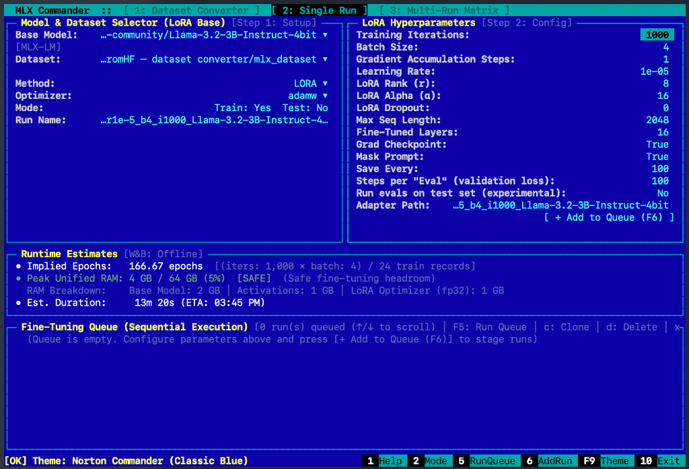
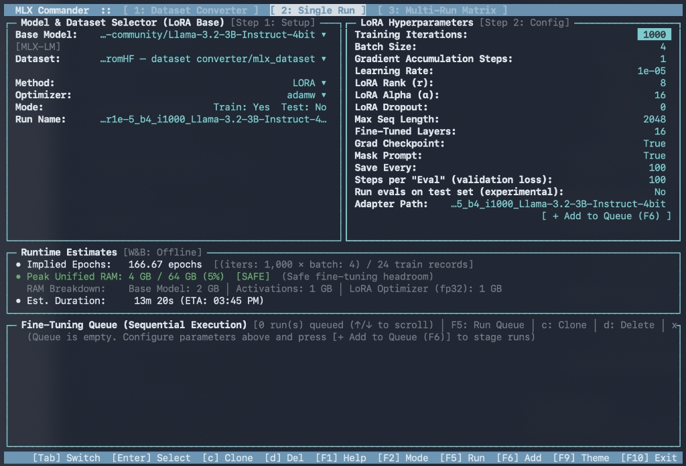
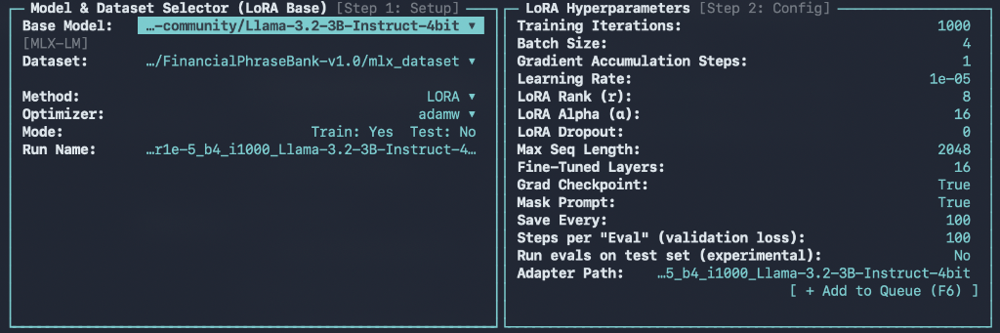
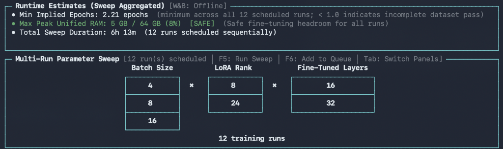
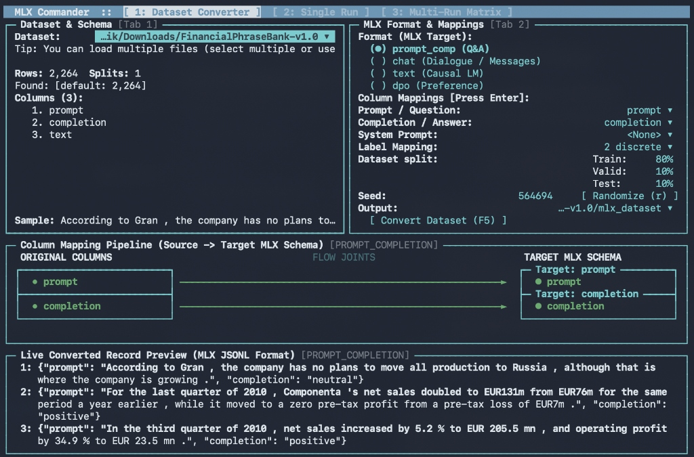

# MLX_Commander 👮

The orthodox commander style TUI, Headless CLI & Model Context Protocol (MCP) Suite for Apple Silicon MLX Training Ops (Single Run & Multi-Run Matrix) and Hugging Face Dataset Preparation.

Built entirely in Python with zero mandatory dependencies and zero pre-compiled binaries.



*Classic Blue theme (orthodox commander style) with full keyboard navigation and multi-mode support*

---

## ⚡ Punchy Overview: Key Features

MLX Commander transforms your Apple Silicon Mac into an autonomous, crash-proof fine-tuning command center:

```text
┌────────────────────────────────────────────────────────────────────────────────────────┐
│                                 MLX COMMANDER WORKFLOW                                  │
├──────────────────────────┬─────────────────────────────────┬───────────────────────────┤
│  1. DATASET CONVERSION   │  2. TRAINING OPS                │  3. GENERATIVE EVALS      │
│     (Hugging Face → MLX) │     (Single Run & Matrix)       │     [EXPERIMENTAL]        │
│  • Parquet / Arrow / Hub │  • 🎯 Single Run (22 params)    │  • 2-Pass Test Bench      │
│  • Auto Train/Val/Test   │  • 👮 Multi-Run Matrix (Grid)   │  • Bandwidth-based ETA    │
│  • 4 Standard Formats    │  • FIFO Queue (Zero OOM Panics) │  • Exact Match & Word F1  │
│  • Concat (+) & Merging  │  • VLM Attention-Mask Shield    │  • Offline HTML Dashboard │
└──────────────────────────┴─────────────────────────────────┴───────────────────────────┘
```

### 🎛️ 1. Training Ops: Single Run and Multi-Run Matrix
*(Comprehensive Configuration & Execution for Apple Silicon MLX)*

- **🎯 Single Run (Mode 2)**:
  - **Zero-Guesswork Parameter Matrix**: Explicit configuration of all 22 MLX fine-tuning hyperparameters (`learning_rate`, `batch_size`, `gradient_accumulation_steps`, `lora_rank`, `max_seq_length`, etc.) with tested production defaults.
  - **Crash-Proof VLM Safeguards**: Automatically detects Vision-Language models (`mlx-vlm` like Gemma 4, Qwen2-VL, PaliGemma) and enforces `batch_size=1` with equivalent gradient accumulation steps—permanently preventing attention mask shape broadcast crashes.
  - **Pre-Flight Memory Estimator**: Analytical calculation of peak Unified Memory (RAM) with real-time `[SAFE]`, `[TIGHT]`, and `[OOM RISK]` safety bands for your exact M-series chip.
  - **Live Validation Milestones**: Discovers `valid.jsonl` and streams validation loss checkpoints directly to the terminal (`★ [Validation Loss Milestone] Iter 100: Val loss = 1.234`).
  - **Implied Epochs Meter**: Computes dataset coverage with dark red warnings when $< 1.0$ epochs.

- **👮 Multi-Run Matrix (Mode 3)**:
  - **Effortless Experiment Planning & Scheduling**: Easily plan and schedule multiple fine-tuning experiments at once without writing brittle bash loops or custom runner scripts.
  - **Visual Cartesian Parameter Grid**: Enter single-line conditions (`Learning Rate: [ 1e-4 ] [ 2e-4 ]`, `LoRA Rank: [ 8 ] [ 16 ]`) to instantly generate an interactive $N_1 \times N_2 \dots$ sweep matrix with aggregate memory and duration estimates.
  - **Crash-Proof Sequential Queue (`--run-queue`)**: Protects Apple Silicon Unified Memory from OOM thrashing, swap exhaustion, and macOS kernel panics by strictly executing queued runs in sequential FIFO order.
  - **Detached Execution**: Spawns jobs in a separate macOS `Terminal.app` window so you can close the TUI or step away while runs execute unattended.

---

### 🧪 2. Generative Test Set Evals [Experimental]
*(Real Token Generation & Regression Benchmarking — Experimental)*

- **Real Decoding (Not Just Perplexity)**: Prompts the trained model token-by-token on `test.jsonl` against baseline zero-shot completions.
- **Physics-Grounded Throughput Engine**: Calibrates evaluation tokens/second and ETA based on model parameter count, quantization, and Apple Silicon memory bandwidth ($\text{tok/s} \propto \frac{\text{Memory Bandwidth}}{\text{Model Active Weights}}$).
- **Comprehensive Accuracy Metrics**: Exact Match, Substring Contains, and Word-Level F1 (Precision & Recall).
- **3-Tier Storage Artifacts**: Appends to a master `eval_leaderboard.csv` (opens in Apple Numbers/Excel), outputs per-run JSON/JSONL predictions, and compiles an offline, zero-dependency `eval_comparison.html` dashboard with interactive regression filters (`[ ⚠️ Regressed Only ]`, `[ ❇️ Fixed Only ]`).
- **Weights & Biases (W&B) Integration**: Streams training curves and uploads interactive prompt diff tables.

---

### 🔄 3. Dataset Conversion & Standardization for MLX
*(Hugging Face to Apple MLX in Seconds — Mode 1)*

- **Turn Any Dataset into MLX Formats**: Ingests Hugging Face repositories or local files (Parquet, Arrow, JSONL, CSV, TSV, SQLite, WebDataset) and formats them into:
  1. **`prompt_completion`** (`{"prompt": "...", "completion": "..."}`) — fully compatible with `mlx_lm.lora --mask-prompt`.
  2. **`chat`** (`{"messages": [{"role": "...", "content": "..."}]}`) — multi-turn instruction tuning.
  3. **`text`** (`{"text": "..."}`) — causal language modeling and continued pre-training.
  4. **`dpo`** (`{"prompt": "...", "chosen": "...", "rejected": "..."}`) — Direct Preference Optimization.
- **Smart Data Transformation**: Multi-column concatenation (`+`) with ordering (e.g. `instruction + input`), multi-file merging, and reproducible deterministic train/val/test splits (`--train 80 --valid 10 --test 10`).
- **Machine-Readable Handshake**: Emits `mlx_manifest.json` with dataset metadata, record counts, and copy-paste CLI commands.
- **Zero Mandatory Dependencies**: Built with Python standard library; handles streaming JSONL and CSV natively out of the box.

---

### 🤖 4. AI Agent & MCP Integration
- **Full Model Context Protocol (MCP) Server**: 8 dedicated tools and prompts for **Antigravity**, **Claude Desktop**, **Cursor**, and **Zed** to inspect datasets, calculate memory safety, queue sweep grids, and trigger evaluations autonomously.

---

### 📋 Feature Matrix

| Capability | Feature Name | What It Does | Why It Matters on Apple Silicon |
|---|---|---|---|
| **Training Ops** | **🎯 Single Run (Mode 2)** | 22 explicit MLX parameters, live validation milestones, implied epochs | Eliminates guesswork; pre-flight RAM estimator prevents OOM crashes; VLM safeguards prevent attention mask errors. |
| **Training Ops** | **👮 Multi-Run Matrix (Mode 3)** | Visual Cartesian grid ($N_1 \times N_2 \dots$), single-line conditions, FIFO queue | Easily plan and schedule multiple experiments without custom scripts; runs unattended while sequential queueing prevents Unified Memory crashes. |
| **Evaluation Engine** | **🧪 Generative Evals [Experimental]** | Real token decoding on `test.jsonl`, baseline comparison, 3-tier reports | Unlike perplexity, tests actual generative capability; physics-grounded speed model predicts exact duration. |
| **Data Ingestion** | **🔄 MLX Dataset Prep (Mode 1)** | Converts Parquet/Arrow/JSONL/Hub to 4 MLX formats with auto-splits | Instant formatting with multi-column concat (`+`), reproducible seeds, and zero mandatory external libraries. |
| **Autonomous Control** | **🤖 MCP Server** | 8 native tools for AI coding agents over stdio | Agents can evaluate RAM, configure sweeps, and run training queues without manual UI clicking. |



*Classic Dark theme which makes Apple MLX hyperparameters and hardware defaults explicit*

---

## 📦 Quick Start

### 1. Installation

Install via `pip` from PyPI:
```bash
pip install mlx_commander

# Or install with all optional extras (Parquet, Arrow, DuckDB, Lance, MCP):
pip install "mlx_commander[all]"
```

Or run instantly without installation using `uvx`:
```bash
uvx mlx_commander
```

Or install globally as a standalone tool via `uv`:
```bash
uv tool install mlx_commander
```

---

### 2. Launching Modes

MLX Commander features a 3-mode switcher (`F2` inside the TUI or via command-line flags):

```bash
# 1. Launch directly into Mode 2: Single Run (Default startup view)
mlx_commander

# Or explicitly via flag:
mlx_commander --single-run

# 2. Launch directly into Mode 3: Multi-Run Matrix (Hyperparameter Sweeps)
mlx_commander --multi-run

# 3. Launch directly into Mode 1: Dataset Converter
mlx_commander --converter

# 4. Execute all queued runs sequentially in an external window:
mlx_commander --run-queue ./mlx_runs
```

---

### 3. Headless Scripting & Automation

You can bypass the TUI entirely for automated pipelines and remote scripts:

#### Headless Dataset Conversion:
```bash
mlx_commander \
  --dataset /path/to/my_hf_dataset.parquet \
  --format prompt_completion \
  --prompt-col question \
  --completion-col answer \
  --train 80 --valid 10 --test 10 \
  --output ./mlx_data
```

#### Headless Sequential Queue Execution:
```bash
python3 -m mlx_commander --run-queue ./mlx_runs
```

---

## 🎛️ Mode 2: Single Run


 
Press **`[F2]`** inside the TUI or simply launch `mlx_commander` (default startup view) to enter **Single Run Mode**.
 
```bash
mlx_commander
# Or explicitly:
mlx_commander --single-run
```

### 1. Dual-Panel Setup
- **Top Left Panel (Model & Dataset Setup)**:
  - **Base Model Picker**: Quick-select from curated 4-bit Apple MLX community models (`Llama-3.2-3B`, `Llama-3.1-8B`, `Qwen2.5-7B`, `Mistral-7B`, `Phi-3.5-mini`, etc.) or input any custom Hugging Face model repository or local weights path.
  - **Dataset Directory**: Auto-synced from Mode 1 conversion output or selected via local path / native macOS Finder picker.
  - **Method**: Select `lora`, `dora` (Weight-Decomposed Low-Rank Adaptation), or `full`.
  - **Optimizer**: Pick `adamw` or `adam`.
  - **Run Name**: Custom label or auto-generated descriptive run signature.

- **Top Right Panel (Explicit Hyperparameters & Resource Estimators)**:
  - **22 Explicit Parameters**: All fine-tuning knobs exposed with tested defaults: `iters`, `batch_size`, `gradient_accumulation_steps`, `learning_rate`, `lora_rank`, `lora_alpha`, `lora_dropout`, `max_seq_length`, `num_layers`, `grad_checkpoint`, `mask_prompt`, `save_every`, `steps_per_eval`, and `adapter_path`.
  - **Unified RAM Safety Estimator**: Detects your Apple Silicon chip and physical RAM via `sysctl hw.memsize` and computes peak memory consumption:
    - **`[SAFE]`** (<70% RAM): Ample headroom for macOS and display compositor.
    - **`[TIGHT]`** (70–85% RAM): Viable, but approaching memory pressure limits.
    - **`[OOM RISK]`** (>85% RAM): Proactively warns before training begins and suggests enabling `grad_checkpoint` or reducing batch size.
  - **Implied Number of Epochs**: Calculated in real time via:

    ```math
    \text{Epochs} = \frac{\text{iters} \times \text{batch\_size} \times \text{gradient\_accumulation\_steps}}{\text{total\_train\_records}}
    ```

    Highlighted in **dark red** if $< 1.0$ to alert you that the model will not observe the complete dataset.
  - **Wall-Clock Duration & Clock ETA**: Estimates execution duration and completion time based on your chip's compute throughput.

---

### 2. Vision-Language & Multimodal Safeguards (`mlx_vlm`)

When training multimodal models (such as Gemma 4, Qwen2-VL, PaliGemma, or SmolVLM) via `mlx-vlm`, micro-batch sizes greater than 1 trigger attention mask shape broadcasting errors due to unpadded multimodal token masks.

MLX Commander automatically detects `mlx_vlm` models and applies mathematical equivalence:

```math
\begin{aligned}
\text{batch\_size} &\leftarrow 1 \\
\text{gradient\_accumulation\_steps} &\leftarrow \text{batch\_size} \times \text{gradient\_accumulation\_steps}
\end{aligned}
```

This preserves identical effective batch size and gradient step dynamics while preventing runtime crashes:
```text
[MLX-VLM Safeguard] Detected mlx-vlm model with batch_size=4.
Auto-tweaked to batch_size=1 and gradient_accumulation_steps=4 (effective batch size: 4).
```

---

### 3. Live Validation Loss Milestones

When `valid.jsonl` is present in the dataset folder, MLX Commander automatically loads it into `val_dataset` and computes validation loss every `steps_per_eval` iterations, highlighting progress milestones in the terminal:
```text
★ [Validation Loss Milestone] Iter 100: Val loss = 1.234 (val took 0.54s)
```

---

## 👮 Mode 3: Multi-Run Matrix



Press **`[F2]`** inside the TUI or pass `--multi-run` from the command line to switch to **Multi-Run Matrix Mode**.

```bash
mlx_commander --multi-run
```

### 1. Single-Line Multi-Value Fields with Clickable Targets
Configure multiple sweep conditions directly on a single line:
```text
Learning Rate:    [ 1e-4 ]  [ 2e-4 ]  [ 5e-4 ]
LoRA Rank (r):    [ 4 ]  [ 8 ]  [ 16 ]
Grad Accum Steps: [ 1 ]  [ 2 ]
Mask Prompt:      [ True ]  [ False ]
```
The rightmost bracketed box represents the active target. Press `Enter` to open a modal dialog to append or edit values as a comma-separated list (e.g. `1e-4, 2e-4, 5e-4`).

---

### 2. Visual Cartesian Sweep Grid
The lower panel renders an interactive Cartesian product grid showing parameter columns, vertically stacked condition cells with dividers, centered `✖` multiplication symbols, and the total scheduled run count (e.g. $3 \times 3 \times 2 \times 2 = 36 \text{ runs}$).

Aggregated sweep estimates update reactively:
- **Peak Unified RAM**: Maximum RAM footprint across all sweep conditions.
- **Total Duration**: Sum of estimated wall-clock durations for all scheduled jobs.
- **Min Implied Epochs**: Minimum implied epochs across conditions.

---

### 3. Sequential FIFO Queue Execution

> [!IMPORTANT]
> **Sequential Execution Only**: Attempting to train multiple LLMs concurrently on Apple Silicon causes catastrophic Unified Memory contention, disk swap thrashing, and kernel panics. MLX Commander strictly processes queued jobs sequentially (FIFO).

Press **`[F5 Run Queue]`**:
- Spawns a dedicated macOS Terminal.app window running `mlx_commander --run-queue mlx_runs`.
- Stdout, training loss, and throughput stream live.
- **You can safely close the main MLX Commander TUI** while background training proceeds undisturbed.

---

## 📊 Generative Test Set Evaluation Engine [Experimental]

Standard `mlx_lm.lora --test` only computes cross-entropy loss and perplexity via teacher forcing—it never prompts the model to generate text.

MLX Commander features a built-in **Generative Evaluation Engine** tagged as **`[Experimental]`**. When enabled (`Run evals on test set: [ Yes ]` or `run_eval=True`), the fine-tuned model loads upon training completion, generates answers token-by-token on `test.jsonl`, and deterministically evaluates completions against reference targets without external scripts.

---

### 1. Physics-Grounded Throughput Engine & Dynamic ETA

Autoregressive token decoding is strictly memory-bandwidth bound:

```math
\text{Generation Speed (tok/s)} \approx \frac{\text{Unified Memory Bandwidth (GB/s)}}{\text{Active Model Weight Footprint (GB)}} \times 0.65
```

Throughput scales inversely with model parameter count and precision:
- **1B–3B 4-bit model** (~0.7–2.0 GB): **150–350 tok/s** (~35s for 50 samples).
- **8B 4-bit model** (~5.2 GB): **40–60 tok/s** (~1m 20s for 50 samples).
- **70B 4-bit model** (~45.5 GB): **5–8 tok/s** (~10m 30s for 50 samples).
- **8B fp16 unquantized** (~16.0 GB): **14–18 tok/s** (~3m 45s for 50 samples).

#### Pre-Evaluation Header:
Before inference starts, the runner prints explicit targets and estimated duration:
```text
[MLX Commander] Starting Generative Evaluation on test set:
  • Target Checkpoint: adapters/01_run/adapters.safetensors (Final trained adapter)
  • Base Model:        mlx-community/Llama-3.2-3B-Instruct-4bit [Engine: mlx_lm]
  • Test Dataset:      dataset/test.jsonl (Full split: 50 samples)
  • Evaluation Passes: 2 passes (Baseline + Fine-Tuned = 100 generations)
  • Estimated Time:    ~35s (model: ~3B 4-bit [~2.0 GB], est. speed: ~150 tok/s on Apple M5 Max)
```

#### Real-Time Milestone Reporting:
During generation, live terminal updates display sample progress, speed, and countdown ETA:
```text
  • [2/2 Fine-Tuned Adapter] Sample 25/50 (50%) | 148.4 tok/s | ETA: 18s
```

---

### 2. Evaluated Metrics

1. **Exact Match (Strict & Normalized)**:
   - *Strict*: Character-for-character equality (`gen == golden`).
   - *Normalized*: SQuAD-standard matching stripping whitespace, punctuation, and English articles (`a`, `an`, `the`).
2. **Substring Contains Match**:
   - Verifies whether the golden completion appears inside the generated text.
3. **Word-Level Precision, Recall, and F1 Score**:
   - Evaluates factual overlap and gives fair partial credit when the model responds in full sentences.
4. **Generation Speed & Efficiency**:
   - Reports sustained tokens per second (TPS) and sample latency.

---

### 3. The "Matrix of Wrong Answers"

1. **Categorical Confusion Matrix** (for classification tasks with $\le 15$ classes):
   - Computes an `[Actual] × [Predicted]` confusion matrix with per-class recall and overall accuracy.
2. **2×2 Model Migration & Regression Matrix** (comparing Pre-Trained Baseline vs Post-Tuning LoRA):

```text
                        POST-TUNING (LoRA)
                     CORRECT           WRONG
                ┌────────────────┬────────────────┐
      CORRECT   │   PRESERVED    │   REGRESSED    │  ◄ Catastrophic forgetting!
BASELINE        ├────────────────┼────────────────┤
      WRONG     │     FIXED      │   PERSISTENT   │  ◄ Where LoRA healed the model!
                └────────────────┴────────────────┘
```
- **`FIXED`**: Baseline failed, but LoRA answered correctly (healed!).
- **`REGRESSED`**: Baseline answered correctly, but LoRA failed (catastrophic forgetting).
- **`PRESERVED`**: Both models answered correctly.
- **`PERSISTENT_FAIL`**: Hard samples failed by both models.

---

### 4. 3-Tier Storage & Offline Dashboard

Evaluation results are organized hierarchically:

```text
models/Llama-3.2-3B/adapters/
├── eval_leaderboard.csv                    <-- TIER 1: Master CSV (open in Numbers/Excel)
├── eval_comparison.html                   <-- TIER 3: Standalone interactive dashboard
│
└── 01_lora_r16_a32_lr1e-4_b4_i1000/
    ├── adapters.safetensors
    ├── eval_summary.json                  <-- TIER 2: Run metadata & matrix stats
    └── eval_predictions.jsonl             <-- TIER 2: Row-by-row prompts, answers, & diffs
```

- **Tier 1 (`eval_leaderboard.csv`)**: Appends a row for every completed run with F1, Exact Match %, regression counts, and speed. Open directly in Apple Numbers, Excel, or Google Sheets to rank sweep runs.
- **Tier 2 (`eval_summary.json` & `eval_predictions.jsonl`)**: Saved inside each run's adapter folder with full prompts, outputs, and transition flags.
- **Tier 3 (`eval_comparison.html`)**: Standalone offline HTML dashboard with metric scorecards, sortable leaderboards, and a **Sample Explorer** with filter buttons (`[ All ]`, `[ ⚠️ Regressed Only ]`, `[ ❇️ Fixed Only ]`, `[ Preserved ]`, `[ Persistent Fail ]`).
- **Weights & Biases (W&B)**: Uploads interactive `wandb.Table` prediction diffs and confusion heatmaps.

---

## 🔄 Mode 1: Dataset Preparation & Ingestion



Press **`[F2]`** to switch to **Dataset Converter Mode** (or launch via `mlx_commander --converter`).

### 1. Supported MLX Formats
1. **`prompt_completion`**: Q&A, instruction pairs, or query/code.
2. **`chat`**: Multi-turn dialogue (`{"messages": [...]}`). Supports OpenAI / ShareGPT formats or separate role columns.
3. **`text`**: Raw causal language modeling / pre-training (`{"text": "..."}`).
4. **`dpo`**: Direct Preference Optimization (`{"prompt": "...", "chosen": "...", "rejected": "..."}`).

### 2. Multi-Column Concatenation & Multi-File Merging
- Tap `Space` on original dataset columns to combine multiple fields (e.g. `instruction + input`) joined by `\n\n`.
- Select multiple dataset files simultaneously (e.g. pre-split `train.jsonl` and `test.jsonl`). Verifies column schemas match and re-splits with reproducible random seeds.

### 3. Machine-Readable Manifest Handshake (`mlx_manifest.json`)
Every conversion emits a structured JSON manifest containing record counts, file sizes, and copy-paste fine-tuning commands:

```json
{
  "status": "success",
  "format": "prompt_completion",
  "source_path": "/path/to/source.parquet",
  "output_dir": "/path/to/mlx_dataset",
  "files": {
    "train": {"path": "/path/to/mlx_dataset/train.jsonl", "records": 8000},
    "valid": {"path": "/path/to/mlx_dataset/valid.jsonl", "records": 1000},
    "test": {"path": "/path/to/mlx_dataset/test.jsonl", "records": 1000}
  },
  "total_records": 10000,
  "seed_used": 42,
  "mlx_lora_command": "mlx_lm.lora --model mlx-community/Llama-3.2-3B-Instruct-4bit --train --data /path/to/mlx_dataset --mask-prompt --iters 600 --batch-size 4"
}
```

---

## 🤖 AI Agent Integration & MCP Server

MLX Commander includes a native Model Context Protocol (MCP) server over `stdio` designed for **Antigravity**, **Claude Desktop**, **Cursor**, **Zed**, and **Cline**.

### 1. Configuration

#### Claude Desktop (`claude_desktop_config.json`):
```json
{
  "mcpServers": {
    "mlx_commander": {
      "command": "python3",
      "args": ["-m", "mlx_commander", "--mcp"]
    }
  }
}
```

#### Cursor (`.cursor/mcp.json`):
```json
{
  "mcpServers": {
    "mlx_commander": {
      "command": "python3",
      "args": ["-m", "mlx_commander", "--mcp"]
    }
  }
}
```

---

### 2. Exposed MCP Tools

| MCP Tool | Category | Description | Key Arguments |
|---|---|---|---|
| `inspect_dataset` | Dataset | Inspects dataset columns, total rows, splits, and candidate mappings. | `dataset_path: str` |
| `convert_dataset_headless` | Dataset | Converts dataset directly to MLX JSONL format in the background. | `dataset_path`, `format`, `prompt_col`, `completion_col`, `train_pct`, `valid_pct`, `test_pct` |
| `launch_conversion_tui` | Dataset | Pre-populates and opens TUI in macOS Terminal.app for visual review. | Same as `convert_dataset_headless` |
| `estimate_fine_tuning_resources` | Fine-Tuning | Estimates peak Unified Memory (GB), safety tier, implied epochs, and duration. | `model`, `iters`, `batch_size`, `gradient_accumulation_steps`, `max_seq_length`, `lora_rank` |
| `queue_single_run` | Fine-Tuning | Enqueues a single fine-tuning job with explicit parameters and VLM safeguards. | `model`, `data_path`, `learning_rate`, `batch_size`, `gradient_accumulation_steps`, `run_eval` |
| `queue_multi_run_sweep` | Fine-Tuning | Expands hyperparameter sweep grid (Cartesian product) and enqueues all runs. | `model`, `data_path`, `learning_rate: List[float]`, `lora_rank: List[int]`, `run_eval: List[bool]` |
| `inspect_queue` | Orchestration | Returns status of all queued, running, completed, and failed jobs. | `queue_dir: str = "mlx_runs"` |
| `execute_queue` | Orchestration | Executes queued jobs sequentially (spawns macOS Terminal or headless). | `queue_dir: str = "mlx_runs"`, `spawn_terminal: bool = True` |
| `run_test_evaluation` | Evaluation [Experimental] | Executes generative evaluation on `test.jsonl` and builds HTML dashboard. | `model`, `adapter_path`, `data_path`, `max_tokens: int = 128` |
| `estimate_test_eval_throughput` | Evaluation [Experimental] | Computes model-dependent generation throughput (tok/s) and eval duration. | `model_name`, `total_samples: int = 50`, `num_passes: int = 2` |
| `launch_lora_tui` | UI | Spawns interactive TUI directly in Mode 2 (Solo Runs) or Mode 3 (Multi-Run Matrix). | `mode: int = 2` (or `3`), `dataset_path`, `model`, `queue_dir` |

---

### 3. Exposed MCP Prompts
- **`prepare_dataset_for_mlx`**: Guides agents through inspecting schema, selecting format, and converting datasets.
- **`orchestrate_fine_tuning`**: Instructs agents on memory estimation, VLM safeguards, sweep queueing, sequential execution, and test evaluations.

---

## 🖥️ Command Line Reference

```
usage: mlx_commander [-h] [-v] [-d DATASET [DATASET ...]]
                     [-f {text,chat,prompt_completion,dpo}]
                     [-o OUTPUT] [--train TRAIN] [--valid VALID] [--test TEST]
                     [--seed SEED] [--keep-splits] [--mapping MAPPING]
                     [--text-col TEXT_COL] [--text-template TEXT_TEMPLATE]
                     [--prompt-col PROMPT_COL] [--completion-col COMPLETION_COL]
                     [--messages-col MESSAGES_COL] [--user-col USER_COL]
                     [--assistant-col ASSISTANT_COL] [--system-col SYSTEM_COL]
                     [--chosen-col CHOSEN_COL] [--rejected-col REJECTED_COL]
                     [--manifest-file MANIFEST_FILE] [--prefill-state PREFILL_STATE]
                     [--spawn-terminal] [--lora] [--multi-run]
                     [--run-queue [DIR]] [--mcp] [--tui] [--no-tui] [--wizard]
```

### Key Flags:

| Flag | Category | Description |
|---|---|---|
| `--single-run`, `--lora` | Mode Switcher | Launch directly into Mode 2: Single Run (Default). |
| `--multi-run` | Mode Switcher | Launch directly into Mode 3: Multi-Run Matrix. |
| `--converter` | Mode Switcher | Launch directly into Mode 1: Dataset Converter. |
| `--run-queue [DIR]` | Execution | Execute queued fine-tuning runs sequentially (default: `mlx_runs`). |
| `-d`, `--dataset` | Data Ingestion | Path to dataset directory or file (`.parquet`, `.jsonl`, `.arrow`, `.csv`, `.sqlite`). |
| `-f`, `--format` | Data Ingestion | Target format (`prompt_completion`, `chat`, `text`, `dpo`). |
| `-o`, `--output` | Data Ingestion | Destination directory where `train.jsonl`, `valid.jsonl`, and `test.jsonl` are saved. |
| `--train`, `--valid`, `--test` | Splitting | Split percentages (e.g. `--train 80 --valid 10 --test 10`). |
| `--seed` | Splitting | Integer seed for deterministic shuffling. |
| `--manifest-file` | Integration | Custom path where machine-readable `mlx_manifest.json` will be written. |
| `--spawn-terminal` | Spawner | Spawns interactive TUI in an external macOS `Terminal.app` window. |
| `--mcp` | MCP | Start Model Context Protocol server over stdio. |
| `--wizard` | CLI | Interactive line-by-line CLI wizard (ideal for SSH sessions). |

---

## 🧪 Running Unit Tests

Run the full test suite with Python's standard library `unittest`:

```bash
python3 -m unittest discover -s tests
```

---

## 📜 License

MIT License. Designed with ❤️ for Apple Silicon and the open-source MLX ecosystem.
